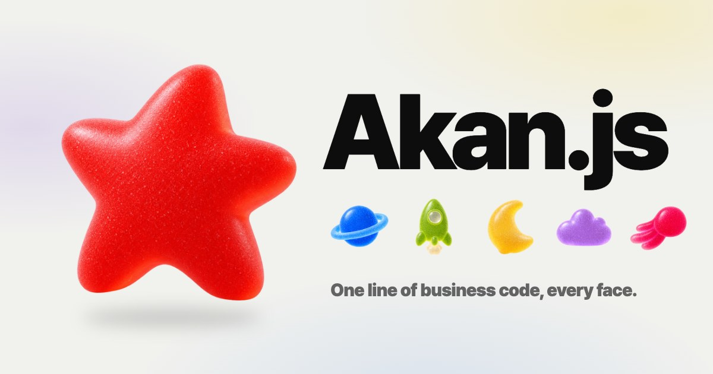
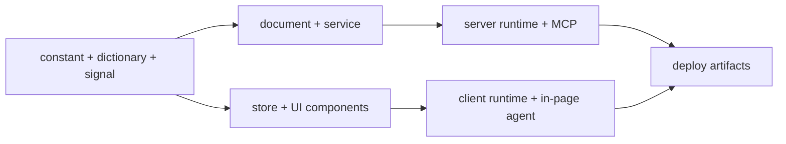

# Akan.js

[English](./README.md) | [문서](https://akanjs.com/docs) | [v3 릴리스 노트](https://akanjs.com/blog/v3release) | [npm](https://www.npmjs.com/package/akanjs)



**에이전트까지 들어 있는 TypeScript 프레임워크.** Bun으로 구동합니다.

**화면을 만들면, 에이전트가 씁니다. 서버를 만들면, AI가 다룹니다.**

툴 스키마도, 따로 쓰는 MCP 서버도, 에이전트용 권한 모델도 없습니다. 사람을 위해 만든 앱이 그대로 AI가 쓰는 앱이
되고, 모델은 원하는 것을 고르면 됩니다. 비즈니스 코드 한 줄이 모든 레이어를 지나 여섯 플랫폼에 닿고, 쓰는 모두에게
이릅니다. 사람에게도, 에이전트에게도요.

## 빠른 시작

### 코딩 에이전트로 시작하기

빈 디렉터리에서 Claude Code나 Codex를 열고 아래 프롬프트를 붙여 넣으세요. 워크스페이스와 앱 이름을 그 아래에
적어 두거나, 에이전트가 묻게 두면 됩니다.

```text
Akan.js(https://akanjs.com) 워크스페이스를 새로 만들어 줘.

1. Bun 1.4 이상이 설치돼 있는지 확인해 줘(`bun --version`). 없거나 버전이 낮으면 https://bun.sh 안내대로 설치하거나 업그레이드해 줘.
2. 워크스페이스 이름과 첫 앱 이름을 물어봐 줘. 짧은 영문 소문자로, 아래에 적어 뒀다면 그걸 쓰면 돼.
3. 이 디렉터리에서 `bunx create-akan-workspace@latest <워크스페이스> --app <앱>`을 실행해 줘. akan CLI를 전역으로 설치하고, ./<워크스페이스>를 만들어 의존성까지 설치해.
4. ./<워크스페이스> 안에서 `akan start <앱>`으로 개발 서버를 백그라운드에 띄우고, 출력된 주소(기본 http://localhost:8282)가 열리는지 확인해 줘.
5. 다 되면 알려 주고, ./<워크스페이스> 안에서 너를 다시 열라고 안내해 줘. 프로젝트의 Akan MCP 서버와 AGENTS.md 규칙은 거기서 로드돼.
```

새 워크스페이스에는 에이전트가 따를 것이 이미 들어 있습니다. `AGENTS.md`와 `CLAUDE.md`, Cursor 규칙, 그리고
Claude Code·Codex·Cursor에 등록된 Akan MCP 서버입니다. 워크스페이스 안에서 에이전트를 다시 열어야 이것들이
로드됩니다.

### 터미널로 시작하기

[Bun](https://bun.sh) `>=1.4.0`이 필요합니다.

```bash
bunx create-akan-workspace@latest
cd <workspace-name>
akan start <app-name> --open
```

워크스페이스 이름과 앱 이름을 물은 뒤 `akan` CLI와 워크스페이스 의존성을 설치하고 샘플 앱을 만들어 줍니다. 앱은
`http://localhost:8282`에서 열립니다.

## 이 모든 게 한 줄입니다

```ts
export class ProductInput extends via((field) => ({
  name: field(String),
})) {}
```

**한 줄 × 8 레이어 × 6 플랫폼 × 사람과 에이전트.**

- **한 줄.** 필드를 더하는 일은 선언 한 줄, 이름과 타입이면 됩니다.
- **× 8 레이어.** 그 한 줄이 스키마, 쿼리, 서비스, API, fetch, 클라이언트 타입, 상태, UI prop까지 뚫고 내려갑니다.
  보통의 스택에서는 손으로 고쳐야 할 8곳이고, 하나라도 빠뜨리면 타입이 깨지거나 런타임에서 터집니다. 여기서는
  함께 바뀝니다.
- **× 6 플랫폼.** 같은 코드가 SEO 웹, iOS·Android 앱, macOS·Windows·Linux 데스크톱 앱으로 배포됩니다. 감싼
  웹사이트가 아니라 네이티브 수준의 화면 전환까지 갖춘 채로요.
- **× 사람과 에이전트.** 가드를 통과한 엔드포인트는 MCP 도구가, 화면의 컨트롤은 인페이지 에이전트 도구가 됩니다.
  사람과 같은 가드를 거쳐서요.

## 당신이 만든 화면이 곧 에이전트의 인터페이스입니다

```tsx
export const Order = () => {
  const { l } = usePage();
  const icecreamOrderForm = st.use.icecreamOrderForm();
  const order = st.tool("createIcecreamOrder", { confirm: true })
    .desc("Place the order in the form.")
    .exec(() => st.do.createIcecreamOrder());
  return (
    <>
      <Field.MultiToggleSelect
        label={l("icecreamOrder.toppings")}
        items={cnst.Topping}
        value={icecreamOrderForm.toppings}
        onChange={st.do.setToppingsOnIcecreamOrder}
      />
      <Button onClick={order}>{l("icecreamOrder.createIcecreamOrder")}</Button>
    </>
  );
};
```

- **원래 쓰려던 화면을 그대로 씁니다.** setter를 넘겨받은 필드는 그 setter를 공개합니다. 버튼 핸들러는 `st.tool`
  한 줄로 툴이 되고, 버튼이 부르는 바로 그 함수가 됩니다.
- **에이전트에게는 픽셀이 아니라 도구가 보입니다.** 연결한 컨트롤마다 자기 이름과 받는 인자로 공개됩니다. 화면에
  없는 것은 목록에도 없습니다.
- **사용자 자신의 탭에서, 그 사용자의 세션으로 화면을 다룹니다.** 클릭과 똑같습니다.
- **중요한 일은 승인을 기다립니다.** `confirm`으로 선언한 툴은 승인 카드에서 멈춥니다.

설정은 레이아웃에 `<Agent.Chat />` 하나, 그리고 `option.ts`에 넣는 모델 키가 전부입니다. OpenAI 호환 호스트와
Anthropic 모두 쓸 수 있습니다.

## 당신의 서버는 이미 MCP 서버입니다

```ts
serveIcecreamOrder: mutation(cnst.IcecreamOrder, {
  guards: [Admin],
})
  .param("icecreamOrderId", ID)
  .exec(async function (icecreamOrderId) {
    return await this.icecreamOrderService.serve(icecreamOrderId);
  }),
refundIcecreamOrder: mutation(cnst.IcecreamOrder, {
  guards: [Every, Person],
})
  .param("icecreamOrderId", ID)
  .with(Self)
  .exec(async function (icecreamOrderId, self) {
    return await this.icecreamOrderService.refund(icecreamOrderId, self.id);
  }),
```

- **MCP 클라이언트에 앱 주소만 넣습니다.** `POST /mcp`는 기본으로 켜져 있습니다. 가드가 허용하는 엔드포인트는 모두
  툴이 되고, 설명은 이미 쓰는 사전에서 옵니다.
- **로그인과 동의는 당신의 앱에서 합니다.** OAuth 2.1은 `libs/shared`에 들어 있습니다. AI는 사용자 한 명의 토큰을
  받고, 권한도 딱 그 사용자만큼이며, 언제든 해지할 수 있습니다.
- **해서는 안 되는 일은 못 합니다.** `refundIcecreamOrder`에는 `Person` 가드가 걸려 있어 목록에 올라가지 않습니다.
  AI에게는 처음부터 없는 툴과 똑같아 보입니다.
- **페이지가 프롬프트가 됩니다.** `page().prompt(name, description)`은 화면을 MCP 프롬프트로 공개합니다. 페이지의
  fetch가 호출자의 토큰으로 실행되고 에이전트는 그 데이터를 받습니다. 따로 맞춰 둘 두 번째 구현은 없습니다.

## 규칙은 하나, 사용자는 셋

가드는 엔드포인트마다 한 번 씁니다. 화면 앞의 사람, 그 사람 탭 안의 에이전트, MCP로 부르는 AI 모두를 같은 가드가
판단합니다.

- **거절은 아무것도 드러내지 않습니다.** 에이전트가 쓸 수 없는 툴은 처음부터 없는 툴과 똑같이 답합니다.
- **호출자마다 속도 제한.** MCP 호출은 호출자마다 분당 120번, 동시에 8개로 묶입니다.
- **비밀은 밖으로 나가지 않습니다.** hidden·secret 필드는 모델에 닿기 전에 빠집니다.
- **연결은 언제든 끝낼 수 있습니다.** 연결을 해지하면 다음 호출부터 거절됩니다. 채팅 릴레이는 세션도 대화도 남기지
  않습니다.

## 만드는 일도 에이전트가

AI 코딩은 일정 규모를 넘으면 스파게티가 됩니다. 에이전트가 코드를 빨리 뽑을수록 파일 위치, 이름, 구조, 선언 방식이
제각각이 되기 때문입니다. Akan은 엄격한 규칙으로 이 문제를 원천 차단합니다.

- **config 파일 지옥은 그만.** `akan.config.ts` 하나로 모든 것을 설정하고, 비어 있어도 앱은 돌아갑니다.
- **엄격한 규칙, 통일된 스타일.** 파일 위치, 이름, 구조, 선언 방식이 통일되고 lint가 이를 지킵니다. 누가 짰든 한
  사람이 쓴 것처럼 읽힙니다.
- **에이전트가 우회할 수 없는 규칙.** 모든 워크스페이스에 생성된 `AGENTS.md`, 번들 가이드라인, 계획 후 적용하는
  워크플로 MCP, 그리고 이를 따라 일하는 터미널 코딩 에이전트 `akan code`가 들어 있습니다.
- **정해진 블록.** 업로드, 로그인, 관리자, 채팅, 게시판, 알림이 미리 만들어진 블록이라, 에이전트는 그 위에서 일관된
  코드만 생산합니다.

## 도메인 모듈

코드는 기술 계층보다 `user`, `product`, `ticket`, `project` 같은 비즈니스 도메인을 기준으로 묶입니다.

```text
lib/product/
├── product.constant.ts    # 모델, 스칼라, enum, 스키마 정의
├── product.dictionary.ts  # i18n 라벨, 설명, 에러
├── product.signal.ts      # 타입 안전한 엔드포인트 계약, 가드
├── product.document.ts    # 영속성과 document 쿼리
├── product.service.ts     # 비즈니스 로직
├── product.store.ts       # 도메인 상태와 action
├── Product.Template.tsx   # 폼 UI
├── Product.Unit.tsx       # 목록 아이템 UI
├── Product.View.tsx       # 상세 UI
└── Product.Zone.tsx       # 페이지 섹션 UI
```



## v2보다 빠르게

v3는 에이전트, MCP, 새 UI 시스템을 더하고도 측정한 모든 지표에서 v2보다 빠릅니다.

| 지표 | v2 | v3 | 변화 |
| --- | --- | --- | --- |
| 초당 요청 수 | 112K | 123K | +10% |
| 응답 시간 (p99) | 1.30 ms | 1.04 ms | −20% |
| 시작 시간 | 204 ms | 102 ms | −50% |
| 대기 메모리 | 84 MB | 57 MB | −32% |
| 부하 중 메모리 | 105 MB | 85 MB | −19% |

- 클라이언트 빌드 결과물: 26MB → 8.1MB (청크 605개 → 258개).
- 클라이언트에서 1,000행 하이드레이션: 3.5ms → 0.9ms.
- 50행 목록 쿼리: 시간 −33%, 할당 85% 감소.

Apple M4 Pro MacBook Pro에서 프로덕션 빌드, 동시 사용자 50명으로 측정했습니다. 측정 도구와 원본 데이터는
[`benchmarks/api-benchmark`](./benchmarks/api-benchmark)에 있습니다.

## 빌드에서 라이브 URL까지

[Akan Cloud](https://cloud.akanjs.com)는 Akan 앱을 위해 만든 배포 플랫폼입니다.

```bash
akan login           # 이 컴퓨터에서 Akan Cloud에 로그인
akan tunnel <app>    # 배포 전에 실행 중인 앱을 공개 URL로 공유
akan build <app>     # Akan Cloud가 돌릴 프로덕션 결과물 빌드
```

## 사람과 에이전트를 위한 문서

- 문서는 [akanjs.com/docs](https://akanjs.com/docs)에 있습니다. 모든 문서 페이지에 인페이지 에이전트가 있어, 주제를
  물으면 문서를 검색해 해당 페이지를 열어 줍니다.
- Claude Code나 Cursor에 `https://akanjs.com/mcp`를 연결하면, AI가 코드를 쓰면서 이 문서를 읽습니다
  (`listDocPages`, `searchDocPages`, `readDocPage`).
- [`llms.txt`](https://akanjs.com/llms.txt)는 어떤 모델이든 읽을 수 있는 문서 색인입니다.

## 하나의 패키지, 여러 경계

Akan은 하나의 npm 패키지 `akanjs`로 배포됩니다. root import는 의도적으로 작게 두고, 서버 전용·클라이언트 전용·UI·
도구 표면은 subpath import로 나눕니다.

```ts
import { Int, dayjs } from "akanjs/base";
import { via } from "akanjs/constant";
import { endpoint } from "akanjs/signal";
import { Button, Layout } from "akanjs/ui";
import { page } from "akanjs/client";
import { AkanApp } from "akanjs/server/akanApp";
```

```css
@import "akanjs/ui/styles.css";
```

| Subpath | 역할 |
| --- | --- |
| `akanjs/base` | 핵심 primitive, 스칼라(`Int`, `Float`, `ID`, `Binary`, `enumOf`), `dayjs`, 환경 헬퍼. |
| `akanjs/common` | 여러 런타임에서 함께 쓰는 헬퍼. |
| `akanjs/constant` | 모델 선언, 스키마 구성, 직렬화, 기본값, `via` 빌더. |
| `akanjs/dictionary` | 라벨, 설명, 에러를 위한 locale·번역·사전 헬퍼. |
| `akanjs/document` | DB document, 필터, 쿼리 빌더, 전문 검색, 영속성 유틸리티. |
| `akanjs/signal` | 엔드포인트, slice, 가드, 미들웨어, 타입 안전한 signal 계약. |
| `akanjs/service` | 서비스, 어댑터, 의존성 주입, 비즈니스 로직 런타임. |
| `akanjs/fetch` | 타입 안전한 fetch, HTTP, WebSocket 클라이언트. |
| `akanjs/store` | 도메인 상태, action, 인페이지 에이전트의 `st.tool` / `st.use` 표면. |
| `akanjs/ui` | React 컴포넌트, recipe, `_overrides.tsx` 슬롯: 레이아웃, 폼, 모달, 테이블, 로딩, 에이전트 채팅. |
| `akanjs/client` | 라우트 체인(`page()`, `layout()`), 라우팅, 쿠키, 스토리지, locale, `cn`. |
| `akanjs/client/native` | iOS·Android·데스크톱 앱을 위한 네이티브 브리지와 내장 플러그인. |
| `akanjs/webkit` | `lazy`, SEO 페이지 같은 브라우저 쪽 헬퍼. |
| `akanjs/server` | 서버 런타임, SSR/RSC, MCP, 로깅, 서버 타입. 엔트리포인트는 `akanjs/server/akanApp`입니다. |
| `akanjs/native/desktop` | 네이티브 플러그인의 데스크톱 부분. |
| `akanjs/test` | 테스트 헬퍼와 샘플 생성. |

도구는 별도 패키지로 배포됩니다. `@akanjs/cli`(`akan` 명령), `@akanjs/devkit`(빌드 러너, 코드 생성, lint 규칙),
`create-akan-workspace`입니다.

## CLI 개요

```bash
akan create-workspace
akan create-application <app>
akan create-module
akan start <app> --open          # 여러 앱은 akan start a,b
akan build <app>
akan build-ios <app>             # build-android, build-desktop도 있습니다
akan lint <app>
akan typecheck <app>
akan test <app>
akan logs <app>
akan code
akan update
```

- **Workspace**: 워크스페이스 생성, lint, sync, `akan doctor`.
- **Application**: 웹·모바일·데스크톱 앱의 start, build, typecheck, test, 패키징.
- **Library**: 공유 라이브러리 생성, 설치, sync, push, pull.
- **Module and scalar**: 도메인 모듈, 모델, view, unit, template, store 생성.
- **Agents**: `akan code`, `akan mcp`, `akan mcp-install`, `akan workflow`, `akan guideline`.
- **Cloud and release**: `akan login`, `akan tunnel`, 배포 자산, 패키지 업데이트.

## 애플리케이션 설정

`akan.config.ts`는 앱 단위 설정을 모으는 단 하나의 파일입니다. 비워 둔 채 시작하고, routes, domains, base paths,
database modes, native app settings가 필요해질 때만 늘려 가면 됩니다.

```ts
import type { AppConfig } from "akanjs";

const config: AppConfig = {
  routes: [
    { domains: { main: ["example.com", "www.example.com"] }, basePath: "web" },
    { domains: {}, basePath: "app" },
  ],
  database: { modes: ["single", "cluster"] },
  native: {
    basePath: "app",
    appName: "Example",
    appId: "com.example.app",
    version: "1.0.0",
    buildNum: 1,
  },
};

export default config;
```

## Contributor Notes

이 저장소는 Bun-first 모노레포입니다. 프레임워크 코드는 `pkgs/akanjs`, 도구는 `pkgs/@akanjs`, 애플리케이션은
`apps`, 공유 라이브러리는 `libs`, 배포 자산은 `infra`에 있습니다. `apps/akan`이 [akanjs.com](https://akanjs.com)
그 자체입니다.

이 저장소 안에서는 `bun run akan`이 CLI를 소스에서 빌드해 실행합니다.

```bash
bun run akan start <app>
bun run akan lint <app>
bun run akan typecheck <app>
bun run akan test <app-or-lib-or-pkg>
```

`AGENTS.md`는 코딩 에이전트와 기여자 모두를 위한 가이드입니다. 프레임워크 코드를 고칠 때는 기존 subpath를 우선
쓰고 root `akanjs` 엔트리포인트는 작게 유지하세요. 이 패키지 경계는 런타임 설계의 일부입니다.

## 오픈소스 메모

- 라이선스: MIT. [`pkgs/akanjs/LICENSE`](./pkgs/akanjs/LICENSE)를 참고하세요.
- 저장소: [akan-team/akanjs](https://github.com/akan-team/akanjs).
- 기여 가이드: [`pkgs/akanjs/CONTRIBUTING.md`](./pkgs/akanjs/CONTRIBUTING.md).
- 행동 강령: [`pkgs/akanjs/CODE_OF_CONDUCT.md`](./pkgs/akanjs/CODE_OF_CONDUCT.md).
